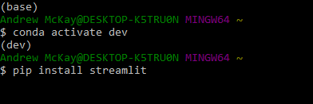
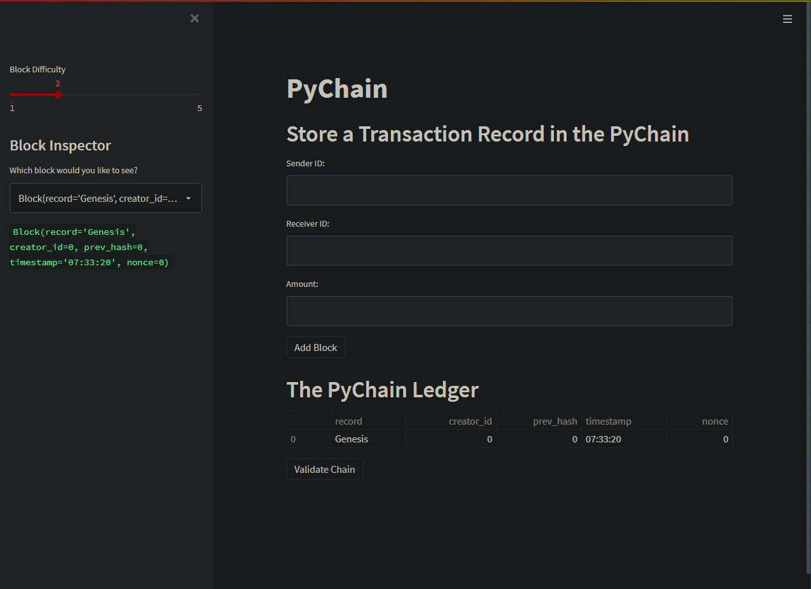
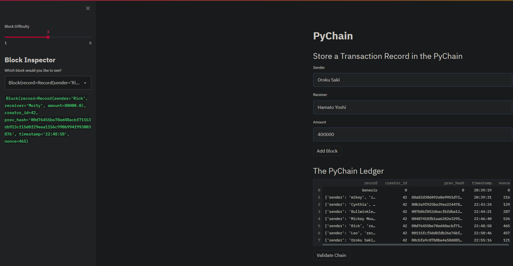
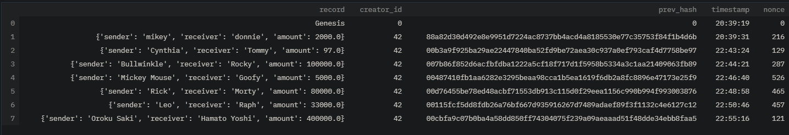
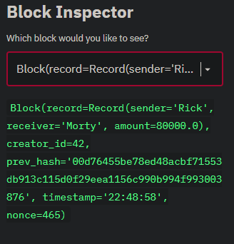
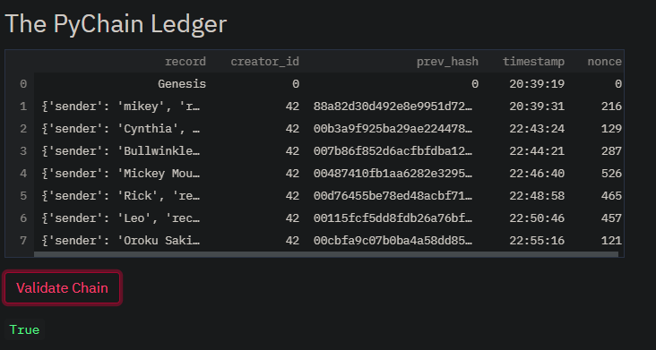
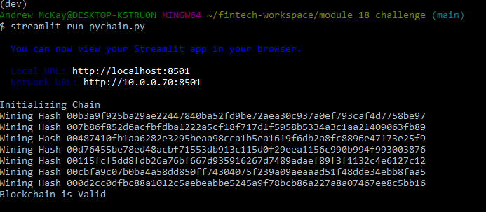

# Module_18_Challenge: Blockchain Ledger

This application uses Stremlit to create a blockchain ledger. The ledger records the transactions that are saved to the blockchain. Each transaction has a sender, receiver, and an amount of money that is transferred between the two.

---

## Technologies
This was run on a pc using Windows 10

This project leverages python 3.8.11 with the following packages:

* [pandas](https://pandas.pydata.org/docs) - For manipulating the DataFrame.

* [Streamlit](https://docs.streamlit.io/en/stable/) - For creating and sharing custom web apps for machine learning and data science.

---

## Installation Guide

In gitbash after you have activated your dev environment, install the following:

*Streamlit

    `pip install streamlit`
    

---

## Examples

The images below show what your blockchain ledger should display. The following outputs are results from running the code.

---

## Contributors

Andrew McKay

Email: andrew.v.mckay@gmail.com

---