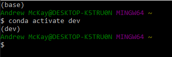

# Module_18_Challenge: Blockchain Ledger

This application uses Stremlit to create a blockchain ledger. The ledger records the transactions that are saved to the blockchain. Each transaction has a sender, receiver, and an amount of money that is transferred between the two. The ledger also validates each transaction.

---

## Technologies
This was run on a pc using Windows 10

This project leverages python 3.8.11 with the following packages:

* [pandas](https://pandas.pydata.org/pandas-docs/stable/index.html) - BSD-licensed library providing high-performance, easy-to-use data structures and data analysis tools for the Python programming language.

* [Streamlit](https://docs.streamlit.io/en/stable/) - For creating and sharing custom web apps for machine learning and data science.

---

## Installation Guide

In gitbash after you have activated your dev environment, install the following:

*Streamlit

    `pip install streamlit`
    

---

## Examples

The images below show what your blockchain ledger will display when you run your application. The following screenshots are results from running the application and adding blocks to the ledger through the web app.

---

---

## Contributors

Andrew McKay

Email: Andrew.V.McKay@gmail.com

---